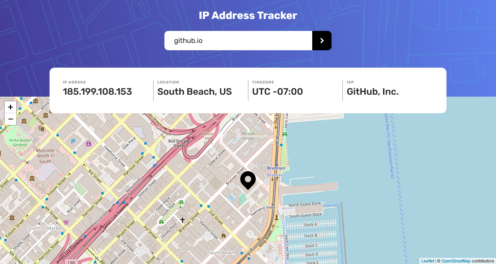
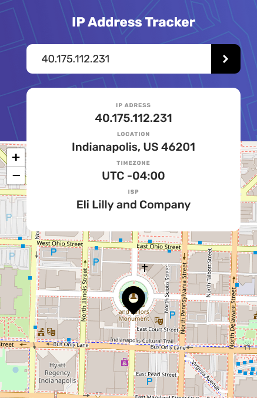

# IP ADDRESS TRACKER

A Single Page Application for tracking ip address enhanced with a map,
the app uses [IP Geolocation API by IPify](https://geo.ipify.org/) To get the IP Address locations
and [LeafletJS](https://leafletjs.com/) for generating the map.

## Overview

### Foncionnality

- Responsive design.
- Users can see their IP address on the map on the initial page load.
- Search for any IP addresses or domains and see the key information and location

### Screenshot

#### Desktop view

#### Mobile view

### Links

- Live Site URL: [https://dyios.github.io/ip-address-tracker/](https://dyios.github.io/ip-address-tracker/)

## My process

### Built with

- Mobile-first workflow
- Semantic HTML5 markup
- CSS3
- Flexbox
- [React](https://reactjs.org/) - JS library